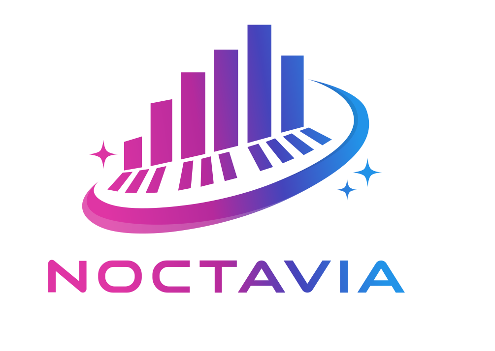

# Noctavia



A Synthesia-style MIDI trainer built with Rust and Iced.

## Project Structure

This project is a Rust monorepo:

- [`noctavia`](./crates/noctavia): Main Iced application entry point.
- [`noctavia_app_core`](./crates/noctavia_app_core): Shared application logic and state management.
- [`noctavia_midi`](./crates/noctavia_midi): Consolidated MIDI logic including domain models, file parsing, timing clock, hardware I/O, and synthesizer.
- [`noctavia_note_matcher`](./crates/noctavia_note_matcher): Logic for comparing user input against a song.
- [`noctavia_piano_roll`](./crates/noctavia_piano_roll): Specialized high-performance piano roll renderer.
- [`noctavia_render`](./crates/noctavia_render): Core 3D rendering engine, camera management, and developer visualization tools.
- [`noctavia_settings_store`](./crates/noctavia_settings_store): Persistence for user configuration and preferences.
- [`noctavia_telemetry`](./crates/noctavia_telemetry): Logging and performance monitoring.
- [`noctavia_ui_iced_widgets`](./crates/noctavia_ui_iced_widgets): Custom reusable Iced UI components.
- [`noctavia_ui_transport`](./crates/noctavia_ui_transport): UI controls for playback (play, pause, seek).

## Requirements

- Rust (latest stable)
- System MIDI libraries (e.g., `libasound2-dev` on Linux)

## Running

To run the application:

```bash
cargo run
```

To run tests:

```bash
cargo test --workspace
```


## Resources
- https://freepats.zenvoid.org/Piano/acoustic-grand-piano.html
